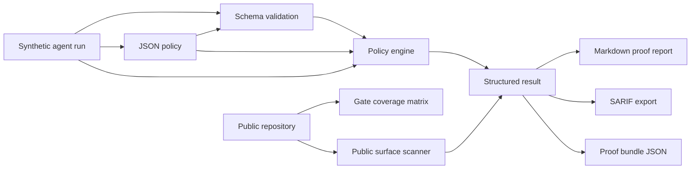

# Architecture

Agent Proof Kit keeps the public proof path small, deterministic and auditable.

## Design Choices

- Deterministic inputs: examples are checked into the repository.
- No provider dependency: the demo does not call model APIs.
- No private data: examples are generated fixtures, not production traces.
- CI-friendly: all gates run with Node.js and no runtime dependencies.
- Narrow claims: the project verifies specific invariants, not model quality.
- Fail closed: unknown action types and unscanned files are blocking findings.
- Traceable claims: every public gate is mapped to implementation files, verification paths and generated proof.

## Core Invariants

| Invariant | Why it exists |
| --- | --- |
| Synthetic marker | Prevents accidental publication of real traces. |
| Schema validation | Turns `schemaVersion` into an enforceable contract. |
| Decision trace | Makes agent behavior inspectable. |
| Declared final claims | Prevents public assertions from bypassing evidence checks. |
| Evidence coverage | Keeps public claims attached to reproducible proof. |
| High-risk containment | Forces approval, blocking, refusal, or redaction paths. |
| Public surface scan | Catches credential-shaped values, configured private terms and unscanned files before push. |
| Gate coverage matrix | Shows where each public claim is implemented, tested and represented in generated artifacts. |

## Extension Points

- Add adapters that normalize provider-specific logs into the fixture schema.
- Add custom `actionRisk` mappings for different teams.
- Add export formats such as SARIF or JSON summaries.
- Upload generated SARIF to GitHub code scanning in downstream repositories.
