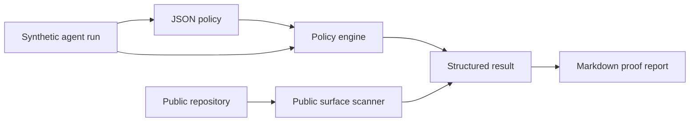

# Architecture

Agent Proof Kit keeps the public proof path small and auditable.

## Design Choices

- Deterministic inputs: examples are checked into the repository.
- No provider dependency: the demo does not call model APIs.
- No private data: examples are generated fixtures, not production traces.
- CI-friendly: all gates run with Node.js and no runtime dependencies.
- Narrow claims: the project verifies specific invariants, not model quality.

## Core Invariants

| Invariant | Why it exists |
| --- | --- |
| Synthetic marker | Prevents accidental publication of real traces. |
| Decision trace | Makes agent behavior inspectable. |
| Evidence coverage | Keeps public claims attached to reproducible proof. |
| High-risk containment | Forces approval, blocking, refusal, or redaction paths. |
| Public surface scan | Catches credential-shaped values and configured private terms before push. |

## Extension Points

- Add adapters that normalize provider-specific logs into the fixture schema.
- Add custom `actionRisk` mappings for different teams.
- Add export formats such as SARIF or JSON summaries.
- Add a GitHub Action wrapper after the local CLI contract stays stable.
